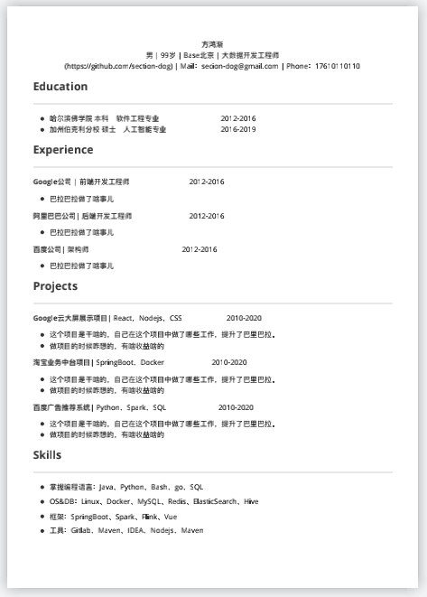

# resume-template

SDE简历模板使用说明：

- 1、安装Typora编辑器 [typora下载](https://typora.io/)
- 2、复制SDE-resume-zh.md的源文件到Typora编辑器中
- 3、根据自己的信息编辑修改
- 4、点击右上角 文件->导出->PDF

---

效果图PDF如下：




推荐使用STAR法则（背景+任务+行动+结果），条理清晰、层层递进、主次分明，浓缩整段工作经历，用2~3句话概括性描述。

【正确示范】
```
负责公司核心的xx业务，为提升关键指标和用户体验，独立完成从需求调研、方案输出到项目落地工作，共推进35个项目上线。和各方团队均保持紧密协作，高效协调资源分配。所负责业务的关键指标相对提升120%、客诉下降60%，获得企业优秀员工称号（部门前5%）
```
注意不要生搬硬套结构，将经历写成一篇叙事小作文，这样反而会使得内容显得啰嗦冗长。


【错误示范】
```
【背景】我在xx科技公司担任项目经理一职，负责xx业务。【任务】我的目标是提升用户日活和优化用户体验，以及协助其他部门完成一系列工作推进。【行动】对此我分别进行了项目规划、文档输出、研发推进等工作，和其他团队同事合作，确保项目规划准时落地。【结果】最后获得业绩增长，业务指标相对提升120%、客诉下降60%，我也被评选为企业优秀员工。
```
